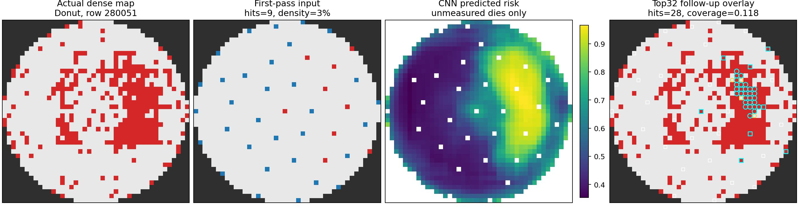
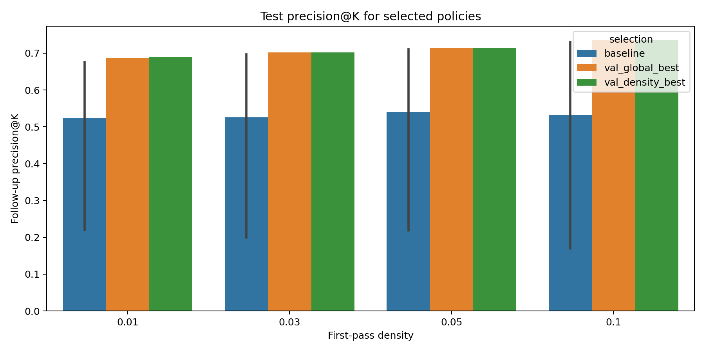
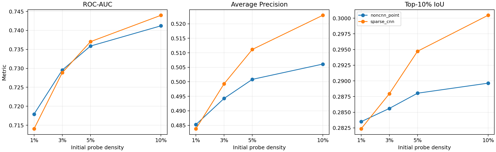
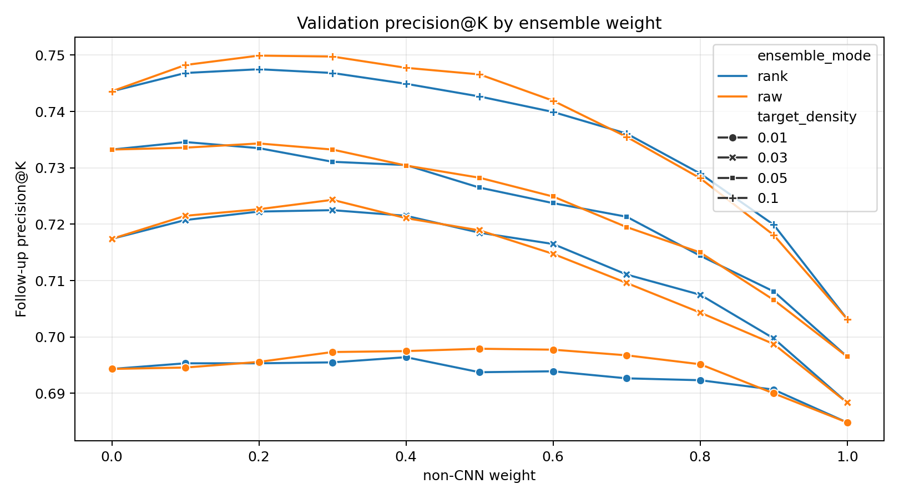
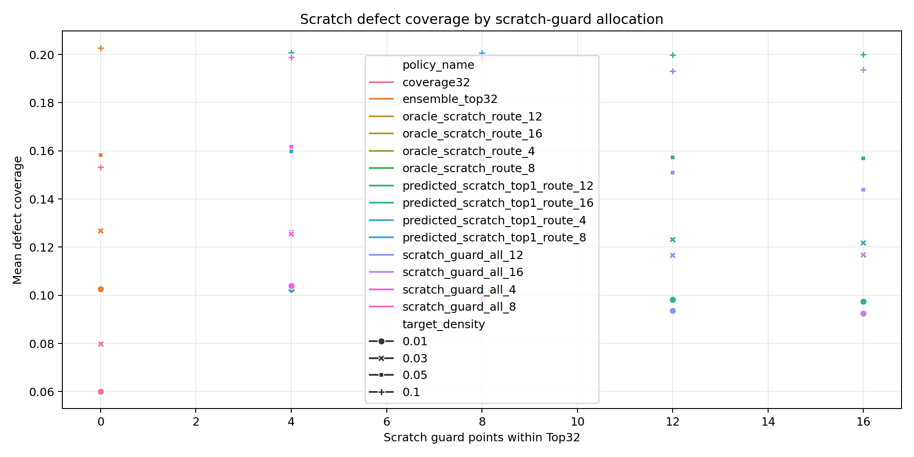
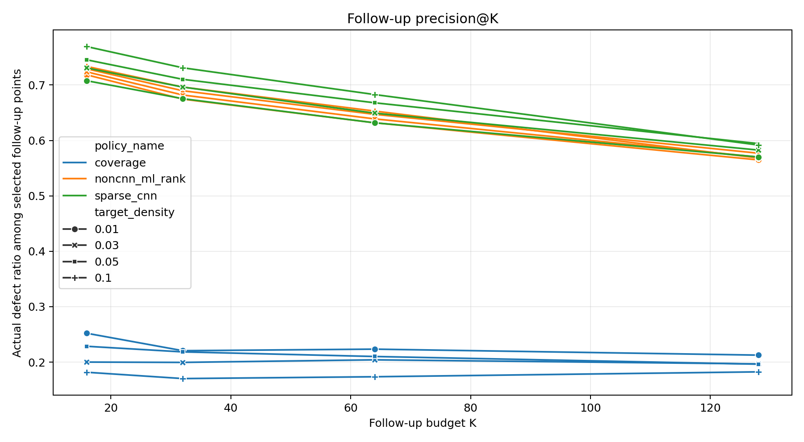
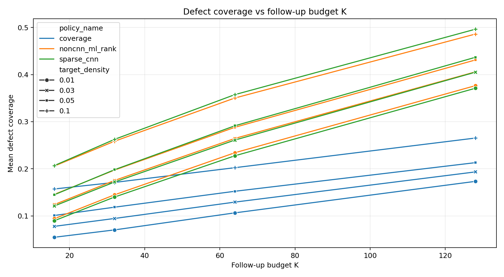
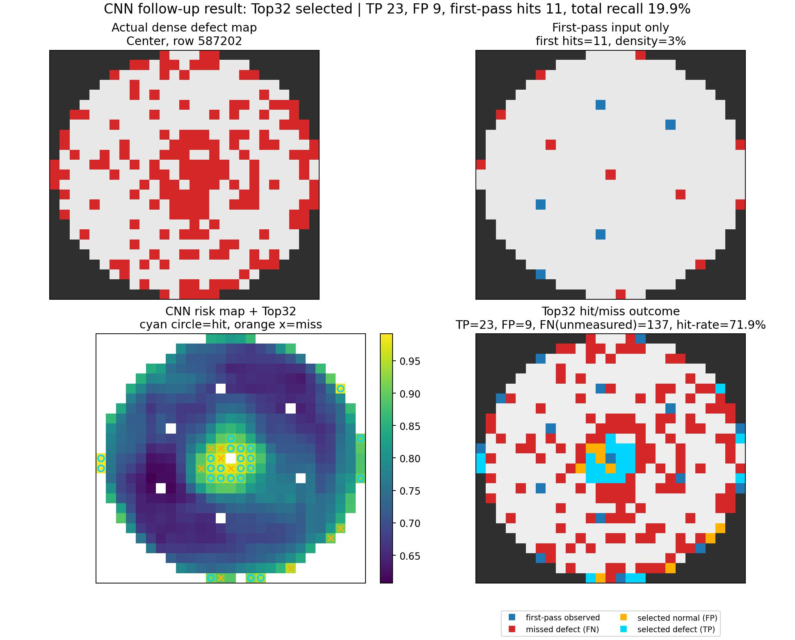

# Wafer Defect Follow-Up Sampling

Risk-based follow-up sampling for sparse wafer defect observation.

For a detailed technical report, see
[docs/technical_report.md](docs/technical_report.md).

Most WM-811K projects classify the defect pattern of a wafer map. This project
asks a different inspection question:

> After a cheap first-pass wafer scan, where should we spend the next limited
> follow-up measurements to find the most likely defective dies?

The dense WM-811K wafer maps are used only as offline ground truth for
evaluation. The recommendation model only sees the sparse first-pass
observation, wafer geometry, and candidate die coordinates.



## At A Glance

| Question | Answer |
|---|---|
| Problem | Recommend where to spend a limited follow-up inspection budget after sparse first-pass wafer observation |
| Data | WM-811K / LSWMD patterned wafer maps, used as offline dense reference labels |
| Allowed at recommendation time | Sparse first-pass observations, wafer geometry, candidate die coordinates, and derived features |
| Forbidden at recommendation time | Dense wafer map, hidden defect coordinates, actual defect ratio, true `failureType` label |
| Final Top-32 model | RandomForest point-risk ranking (`noncnn_top32`) |
| Baseline | Geometry-only `coverage32` |
| Main metric | Top-32 hit rate / `precision@32` |
| Secondary visual model | Sparse CNN 2D risk map |
| Headline result | Top-32 hit rate improves from 20.1% to 69.1%, a +244.0% relative gain |

## Quick Start

```bash
python -m pip install -r requirements.txt
python scripts/final/prepare_data.py
python scripts/final/run_final_demo.py --max-test-wafers 100
```

The final demo is a lightweight local reproduction check. It compares the
geometry-only `coverage32` baseline against the RandomForest point-risk ranker
and writes a compact summary to `reports/final_demo/final_demo_summary.md`.

If the processed dataset is missing, the demo exits with the exact preprocessing
command instead of fabricating results.

## Headline Result

On a 3-seed repeated wafer-level split on WM-811K patterned wafers, using the
same 32-point follow-up measurement budget:

| Follow-up strategy | Meaning | Avg. true defects found out of 32 | Hit rate among 32 recommendations |
|---|---|---:|---:|
| Geometry-only baseline | Spread points evenly; no defect prediction | 6.43 | 20.1% |
| Final risk model | Rank unmeasured dies by predicted defect risk | 22.10 | 69.1% |

In plain terms:

```text
The final model finds about 15-16 more defective dies per wafer than the
geometry-only baseline, while using the same 32 follow-up points.
```

This is a `+244.0%` relative improvement in hit rate over the geometry-only
baseline in the 3-seed repeated split result.



## Final Decision

```text
Final Top-32 policy: RandomForest point-risk ranking (`noncnn_top32`)
CNN role: 2D risk-map visualization
Ensemble role: ablation only; repeated-split Top-32 result favored RF-only
Baseline: geometry-only `coverage32`
```

## Experimental Setup / Result Provenance

| Item | Setting |
|---|---|
| Dataset | WM-811K / LSWMD patterned defect wafers |
| Evaluation split | Wafer-level train/validation/test split |
| Seeds | 42, 101, 202 |
| First-pass densities | 1%, 3%, 5%, 10% of valid dies |
| Test wafers | 500 wafers per density per split |
| Follow-up budget | K = 32 unmeasured valid dies |
| Primary metric | Hit rate among Top-32 recommendations (`precision@32`) |
| Secondary metrics | True defects found, defect coverage, severe miss rate, defect-ratio bias warning |

The main result is not a die-level random split. Entire wafers are split between
train, validation, and test so that candidates from the same wafer do not appear
in both training and test evaluation.

## Why This Is Not Ordinary Wafer Classification

Typical WM-811K repositories train a model to answer:

```text
What defect pattern class is this wafer?
```

This project answers:

```text
Given only a sparse first-pass observation, which unmeasured dies should be
probed next under a fixed follow-up budget?
```

That makes the task closer to inspection/metrology decision support than image
classification. The output is not only a class label. It is:

1. A defect risk score for each unmeasured die.
2. A 2D wafer risk map.
3. A Top-K follow-up recommendation list.
4. Offline hit/miss evaluation against the hidden dense wafer map.

## Problem Setup

WM-811K wafer maps contain die-level states:

```text
0 = outside wafer / invalid die location
1 = normal die
2 = defective die
```

For each wafer:

1. Simulate a sparse first-pass observation, such as 1%, 3%, 5%, or 10% of valid
   dies.
2. Hide the rest of the dense wafer map from the model.
3. Score every unmeasured valid die by predicted defect risk.
4. Recommend the Top-K follow-up dies.
5. Reveal the dense map only after selection to evaluate how many actual
   defects were found.

The main operating example uses `K = 32` follow-up points because it is a small,
fixed inspection budget that makes different policies easy to compare. The
project also evaluates K = 16, 32, 64, and 128.

## Information Boundary / Leakage Prevention

Dense wafer maps are used only as offline ground truth. The recommendation model
does not see hidden defect locations when it chooses follow-up dies.

Allowed at recommendation time:

```text
- first-pass sparse observation
- wafer geometry
- candidate die coordinates/features
- distances/features derived from first-pass evidence
- model risk scores derived from allowed features
- CNN risk map derived from sparse observation
```

Forbidden at recommendation time:

```text
- dense wafer defect map
- hidden defect coordinates
- actual total defect count
- actual defect ratio
- true failureType label
- future wafer or lot information
```

All model evaluation uses wafer-level train/validation/test splits to avoid
training on dies from the same wafer that later appears in test evaluation.

## What The Metrics Mean

| Public wording | Technical metric | Meaning |
|---|---|---|
| Hit rate among recommended dies | precision@K | Of the K dies recommended for follow-up, how many were actually defective? |
| True defects found | follow-up defects | Number of defective dies found in the K follow-up points |
| Defect coverage | defect coverage | Fraction of all hidden defective dies hit by the selected follow-up points |
| Severe miss | severe miss rate | Wafer had defects, but sampling found none |
| Bias warning | absolute error delta | How much the sampled defect ratio shifts versus the geometry baseline |

The main metric for this project is hit rate among recommended dies. Defect
coverage is also reported, but a Top-32 policy cannot cover every defect when a
wafer contains far more than 32 defective dies.

## Baselines And Models

| Name in code | Public name | What it does | Why it matters |
|---|---|---|---|
| `coverage32` | Geometry-only baseline | Selects 32 unmeasured dies to improve spatial coverage | Conservative reference: no ML and no defect prediction |
| `noncnn_top32` | Final point-risk Random Forest | Scores each candidate die using first-pass and coordinate features | Best multi-seed Top-32 recommendation policy |
| `cnn_top32` | Sparse CNN risk map | Converts sparse observations into a 2D risk heatmap | Best visual explanation / 2D risk-map deliverable |
| `ensemble_raw_w0.30` | CNN + RF ensemble | `0.3 * RandomForest risk + 0.7 * CNN risk` | Strong ablation, but not selected as final Top-32 policy |

The geometry-only baseline is not a defect model. It does not know where defects
are. It simply spreads the follow-up points across the wafer to be spatially
representative.

## Final Recommendation Algorithm

The final operating policy is a Random Forest point-risk ranker.

For one wafer, it works like this:

```text
Input:
- sparse first-pass observation
- valid wafer die geometry
- list of all unmeasured valid dies

For each unmeasured candidate die:
1. Build a feature vector describing:
   - wafer size and valid die count
   - first-pass sampling density
   - how many defects were already hit in the first pass
   - whether first-pass hits were center / middle / edge
   - candidate die normalized y/x/radius/angle
   - candidate die radial zone and quadrant
   - distance to nearest first-pass sampled die
   - distance to nearest first-pass defective hit
   - distance to the centroid of first-pass defective hits
   - whether candidate shares quadrant/radial zone with any first-pass hit
2. RandomForest predicts:
   P(candidate die is defective | first-pass evidence + candidate geometry)
3. Sort all unmeasured candidates by this probability.
4. Recommend the Top 32 candidates for follow-up inspection.
```

The score is therefore:

```text
risk_score(candidate) =
    RandomForestClassifier.predict_proba(candidate_features)[defect_class]
```

The dense wafer map is never used to compute this score. It is used only after
the recommendation is made, to check how many selected dies were truly
defective.

Feature groups used by the final ranker:

| Feature group | Examples | Why it helps |
|---|---|---|
| Wafer geometry | map height, width, valid die count | Different wafer shapes have different valid regions |
| First-pass evidence | sampled count, hit count, sampled defect ratio, no-hit flag | Tells whether the sparse scan already saw risk |
| Hit location summary | center/mid/edge hit counts | Captures where early defects appeared |
| Candidate position | normalized y/x, radius, angle sin/cos | Lets the model learn center, edge, ring, and quadrant effects |
| Candidate zone | center/mid/edge, quadrant flags | Encodes coarse wafer regions |
| Distance to evidence | nearest sampled die, nearest hit, hit centroid | Captures proximity to observed defect-rich areas |
| Shared region flags | same quadrant / same radial zone as first-pass hit | Captures pattern continuation without using the hidden dense map |

## Modeling Process

The project improved through several stages.

### 1. Geometry-only sampling baseline

The first baseline selected follow-up dies based only on spatial coverage. This
answers a conservative question:

```text
If we do not predict defects at all, how many defects do we find by spreading
points evenly?
```

This baseline is useful because fabs often care about representativeness, not
only chasing a single suspicious region.

### 2. Non-CNN point-risk model

The first ML model treated each unmeasured die as a candidate and predicted
whether it was likely to be defective.

Model:

```text
RandomForestClassifier
point estimators: 100 in the final repeated-split comparison
max depth: 14
min samples per leaf: 10
class weight: balanced
candidate sampling per wafer:
- max defect candidates: 80
- max normal candidates: 120
train/test split: wafer-level split, not die-level leakage split
```

Why Random Forest:

```text
Random Forest is a tree ensemble. It builds many decision trees and averages
their probabilities. It is a strong tabular baseline, handles nonlinear
coordinate/risk interactions, works well with mixed geometric features, and
gives robust candidate ranking without requiring GPU training.
```

The number of trees was kept at 100 for the final comparison because it was
large enough to stabilize candidate ranking while keeping repeated split
experiments practical. Earlier experiments also used larger forests, but the
final comparison needed repeated retraining across densities and seeds.

### 3. Sparse CNN risk map

The CNN model predicts a full 2D defect risk map from sparse first-pass
observation channels.

Architecture:

```text
Input channels: 7
Hidden channels: 32
Layers:
1. Conv2d(7 -> 32, kernel=7) + GroupNorm + ReLU
2. Conv2d(32 -> 32, kernel=3, dilation=2) + GroupNorm + ReLU
3. Conv2d(32 -> 32, kernel=3, dilation=4) + GroupNorm + ReLU
4. Conv2d(32 -> 32, kernel=3) + GroupNorm + ReLU
5. Conv2d(32 -> 1, kernel=1)

Training:
- optimizer: Adam-style PyTorch training loop
- learning rate: 1e-3
- weight decay: 1e-4
- loss: binary cross entropy with positive-class weighting
- max epochs in Colab robustness run: 8
- early stopping patience: 3
- AMP mixed precision: enabled on Colab GPU
```

Why this architecture:

```text
The model is intentionally small. Wafer maps are structured 2D grids, so a CNN
can learn local and regional spatial patterns. Dilated convolutions expand the
receptive field without making the model deep or expensive. Coordinate/radius
channels let the model learn wafer geometry such as edge, center, and radial
effects.
```



### 4. Ensemble test

The CNN and Random Forest were combined by validation-set tuning:

```text
score = w * RandomForest_probability + (1 - w) * CNN_probability
```

Weights tested:

```text
w = 0.0, 0.1, 0.2, ..., 1.0
```

Validation selected the global best:

```text
w = 0.3
Validation-selected ensemble score =
    0.3 * RandomForest_probability + 0.7 * CNN_probability
```

This ensemble candidate relied more on the CNN risk map while retaining some
stability from the tabular point-risk model.



However, the repeated split result showed that the Random Forest point-risk
ranker was slightly more stable for the actual Top-32 recommendation task:

```text
Average hit rate across 1/3/5/10% first-pass density:

geometry-only baseline: 20.1%
CNN-only:               65.8%
CNN + RF ensemble:      68.6%
RandomForest-only:      69.1%
```

Final decision:

```text
Use RandomForest point-risk ranking as the primary Top-32 recommendation
algorithm. Keep the CNN as the 2D risk-map visualization model.
```

Summary:

```text
Final Top-32 policy: RandomForest point-risk ranking.
CNN role: 2D risk-map visualization.
Ensemble role: strong ablation, not selected because repeated-split Top-32
results slightly favored RandomForest-only ranking.
```

### 5. Negative experiments and guardrails

Not every attempted improvement was adopted.

The project tested:

```text
low-evidence gate refinement
Scratch-specific guard points
oracle Scratch routing
predicted Scratch routing
```

Result:

```text
These did not reliably improve the previous ensemble candidate. Fixed Scratch guard points
often displaced better-ranked ensemble candidates.
```

This is why the final policy is not simply "add special Scratch lines." Scratch
remains an explicit limitation and future improvement area.



## Main Results

Repeated split result across seeds 42, 101, and 202. Each split evaluates 500
test wafers per first-pass density with 32 follow-up points.

| First-pass observed dies | Geometry-only hit rate | Final RF model hit rate | Relative gain | Extra defects found out of 32 |
|---:|---:|---:|---:|---:|
| 1% | 22.2% | 68.2% | +207.0% | +14.71 |
| 3% | 20.0% | 68.8% | +243.3% | +15.61 |
| 5% | 21.4% | 69.4% | +224.6% | +15.37 |
| 10% | 16.7% | 69.9% | +318.7% | +17.02 |

Average:

```text
Geometry-only baseline: 20.1% hit rate
Final RandomForest:     69.1% hit rate
Relative gain:          +244.0%
```

The improvement also holds when the follow-up budget changes.





## Visual Example

The figure below shows a wafer-level offline validation example. The model sees
only the sparse first-pass input, produces a 2D risk map, and then recommends
follow-up locations. The dense map is used only afterward to mark hit/miss.



## Dataset Access

This project uses WM-811K / LSWMD. The raw pickle is not included because it is
large and should be obtained separately by the user.

Expected local path:

```text
LSWMD.pkl/LSWMD.pkl
```

Expected columns:

```text
waferMap
dieSize
lotName
waferIndex
trianTestLabel
failureType
```

Note: `trianTestLabel` is the original dataset spelling.

## Reproduce

Install lightweight dependencies:

```bash
python -m pip install -r requirements.txt
```

Extract labeled and patterned wafer subsets:

```bash
python scripts/final/prepare_data.py
```

This creates:

```text
data/processed/metadata/labeled_metadata.csv
data/processed/subsets/labeled_subset.pkl
data/processed/subsets/patterned_subset.pkl
reports/dataset_summary.md
```

Run the full repeated-split robustness workflow:

```bash
python experiments/79_run_repeated_split_robustness_colab.py ^
  --seeds 42 101 202 ^
  --densities 0.01 0.03 0.05 0.10 ^
  --top-k 32 ^
  --epochs 8 ^
  --patience 3 ^
  --max-train-wafers 2500 ^
  --max-test-wafers 500 ^
  --batch-size 64 ^
  --hidden-channels 32 ^
  --point-estimators 100 ^
  --use-amp
```

The full repeated-split CNN robustness run was executed in Google Colab with a
T4 GPU. The command above is the project runner, but local runtime depends on
GPU availability and may be slow. The Colab notebook used for the GPU run is:

```text
notebooks/colab_repeated_split_robustness.ipynb
```

Local smoke test for the sparse CNN:

```bash
python experiments/71_train_sparse_cnn_risk_map_batched.py ^
  --densities 0.03 ^
  --epochs 1 ^
  --max-train-wafers 80 ^
  --max-test-wafers 20
```

Evaluate the CNN / RandomForest / ensemble comparison if a CNN checkpoint
exists:

```bash
python experiments/76_evaluate_cnn_noncnn_ensemble.py
```

Run the Top-K budget curve:

```bash
python experiments/75_evaluate_topk_budget_curve.py
```

Generate CNN hit/miss visual examples if a compatible CNN checkpoint exists:

```bash
python experiments/73_generate_cnn_hit_miss_visual_examples.py
```

### Expected Outputs

README-tracked figures:

```text
docs/assets/example_donut_risk_map.jpg
docs/assets/example_center_hit_miss.jpg
docs/assets/result_top32_hit_rate.png
docs/assets/topk_hit_rate_curve.png
docs/assets/topk_defect_coverage_curve.png
docs/assets/risk_map_metrics.png
docs/assets/ensemble_weight_validation.png
docs/assets/scratch_guard_result.png
```

Main generated result files:

```text
data/processed/repeated_split_robustness_colab_v1/repeated_split_policy_robustness_summary.csv
data/processed/repeated_split_robustness_colab_v1/repeated_split_policy_seed_summary.csv
data/processed/cnn_noncnn_ensemble_v1/test_selected_ensemble_summary.csv
data/processed/topk_budget_curve_v1/topk_budget_curve_summary.csv
```

## Repository Structure

```text
scripts/final/           public-facing reproduction wrappers
experiments/             chronological experiment history scripts
src/                     reusable sampling and feature utilities
reports/                 project log, summaries, and positioning notes
docs/assets/             README figures tracked for public GitHub display
data/processed/          generated local experiment outputs, ignored by Git
outputs/figures/         generated local figures, ignored by Git
models/                  trained checkpoints, ignored by Git
papers/                  local paper references used during project planning
```

## What This Project Is Not

```text
- Not a production fab recipe
- Not a claim of real yield improvement
- Not SEM image classification
- Not root-cause analysis
- Not a complete dense wafer reconstruction system
- Not generic WM-811K defect-pattern classification
```

## Current Limitations

```text
1. WM-811K is a proxy dense-reference dataset, not a live fab metrology or
   follow-up inspection log.
2. No tool, chamber, recipe, FDC, process history, or lot-context signals are
   available in WM-811K.
3. Scratch and Loc patterns remain harder than Center, Edge-Ring, and Donut-like
   spatially concentrated patterns.
4. Defect-ratio estimation and defect discovery can conflict. A policy that
   intentionally targets defect-rich regions may become biased for estimating
   the overall wafer defect ratio.
5. CNN improves visualization, but the repeated-split Top-32 recommendation
   result selected RandomForest as the primary operating policy.
6. This is not a production recipe and does not claim deployed yield
   improvement.
```

## References And Related Work

Public WM-811K projects often focus on classification accuracy, README visuals,
or dataset explanation. Useful references reviewed while shaping this README:

- [Semiconductor-Wafer-Defect-Classification](https://github.com/iamxichen/Semiconductor-Wafer-Defect-Classification)
- [wafer-defect-maps](https://github.com/chrisshaffer/wafer-defect-maps)
- [sequential_wafer_inspection](https://github.com/adekhovich/sequential_wafer_inspection)
- [wafer-inspection](https://github.com/caslabai/wafer-inspection)
- [WM-811K dataset explanation](https://github.com/makinarocks/awesome-industrial-machine-datasets/blob/master/data-explanation/WM-811K%28LSWMD%29/README.md)

The key distinction is that this repository focuses on limited-budget follow-up
site recommendation, not only wafer defect class prediction.
For deeper reproduction, the underlying experiment script is
`experiments/01_extract_labeled_subset.py`.
